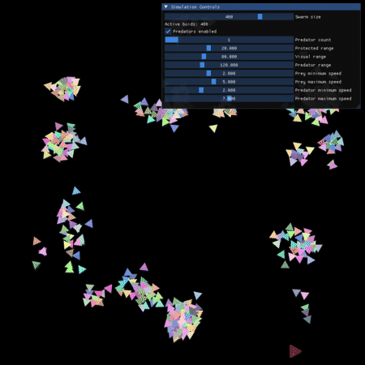

# Boids — Flocking Simulation

A real-time 2D boids flocking simulation written in C++ with [raylib](https://www.raylib.com/),
featuring predator–prey dynamics and a live parameter-tuning GUI built with
[Dear ImGui](https://github.com/ocornut/imgui) via [rlImGui](https://github.com/raylib-extras/rlImGui).

Based on Craig Reynolds' classic boids model (separation, alignment, cohesion), extended with
fleeing behaviour and independent predators that hunt the flock.



## Features

- **Three core flocking rules** - separation, alignment, and cohesion
- **Predator–prey dynamics** - prey flee nearby predators; predators chase their nearest prey
- **Multiple predators** - toggle on/off and adjust the count live
- **Real-time tuning** - every simulation parameter is adjustable through an ImGui panel
- **Edge handling** - boids steer back from the screen margins instead of wrapping

## Controls

All tuning is done through the **Simulation Controls** panel:

| Parameter              | Description                                       |
|------------------------|---------------------------------------------------|
| Swarm size             | Number of prey boids (100–500)                    |
| Predators enabled      | Toggle predators on/off                           |
| Predator count         | Number of predators (1–10)                        |
| Protected range        | Distance at which boids push apart (separation)   |
| Visual range           | Distance for alignment & cohesion neighbours      |
| Predator range         | Distance at which prey start fleeing a predator   |
| Prey min/max speed     | Speed clamp for prey                              |
| Predator min/max speed | Speed clamp for predators                         |

## Building

### Prerequisites
- A C++17 compiler (MinGW-w64 / MSVC / GCC / Clang)
- Git (the project uses submodules)

> raylib is downloaded automatically by premake on first build — you don't need to install it.

### Clone (with submodules)
```bash
git clone --recursive https://github.com/<you>/boids.git
```

### Windows — MinGW-w64
```bash
build-MinGW-W64.bat   # runs premake + downloads raylib
make
bin/Debug/boids.exe
```

### Windows — Visual Studio
```bash
build-VisualStudio2022.bat   # or build-VisualStudio2026.bat then open the generated .sln / .slnx and build
```

### Linux / macOS
```bash
cd build
./premake5 gmake      # macOS: ./premake5.osx gmake
cd ..
make
./bin/Debug/boids
```

## Project structure
```
src/
  main.cpp           Entry point, raylib loop, ImGui panel
  settings.hpp       All tunable simulation parameters
  boid.hpp/.cpp      Single boid: separation, alignment, cohesion, flee
  flock.hpp/.cpp     Collection of boids
  predator.hpp/.cpp  Predator that hunts the nearest prey
build/
  premake5.lua       Build configuration
```

## Roadmap
- [x] Core flocking (separation / alignment / cohesion)
- [x] Predator–prey behaviour
- [x] Multiple predators + ImGui controls
- [ ] Limited field of view (270°) for predators and prey
- [ ] Obstacles for boids to steer around
- [ ] Spatial partitioning (uniform grid) for performance

## Credits
- [raylib](https://github.com/raysan5/raylib) — zlib/libpng license
- [Dear ImGui](https://github.com/ocornut/imgui) — MIT license
- [rlImGui](https://github.com/raylib-extras/rlImGui) & [raylib-quickstart](https://github.com/raylib-extras/raylib-quickstart) by Jeffery Myers
- Boids model by [Craig Reynolds](https://www.red3d.com/cwr/boids/);
  pseudocode reference: [Stanford / Conrad Parker](https://cs.stanford.edu/people/eroberts/courses/soco/projects/2008-09/modeling-natural-systems/boids.html)

## License
Released under the [MIT License](LICENSE). Bundled dependencies retain their own licenses
(see [Credits](#credits)).
